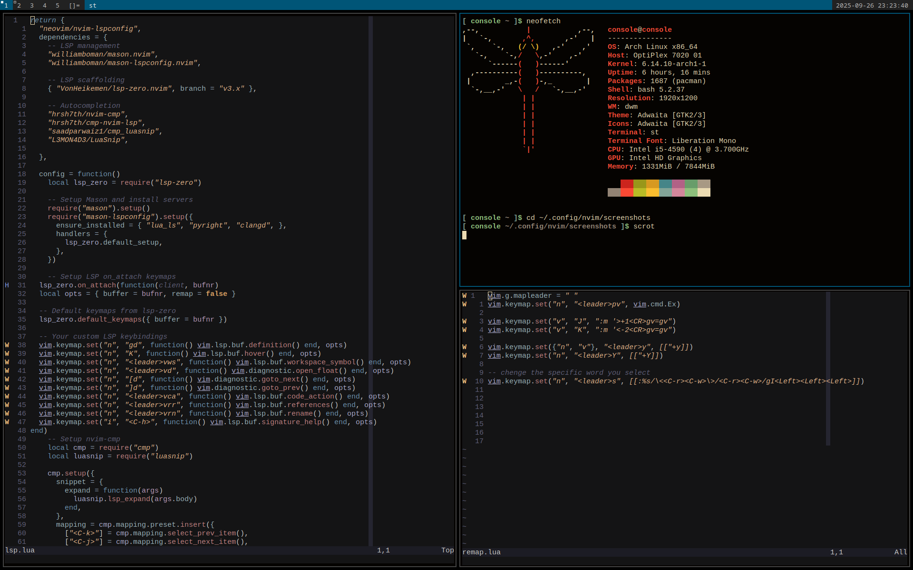
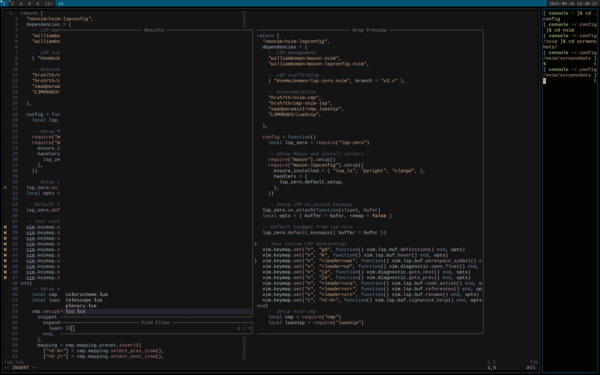

# 🧠 Neovim Dotfiles

Welcome to my personal Neovim configuration — clean, fast, and fully written in **Lua**.  
It uses **lazy.nvim** for plugin management, and includes modern tools like LSP, Telescope, Treesitter, and Harpoon.

> 🔗 [github.com/rusty407/dotfiles](https://github.com/rusty407/dotfiles)

---

## ⚙️ Features

- 📦 Lazy plugin loading with [`lazy.nvim`](https://github.com/folke/lazy.nvim)
- 🧠 Full LSP support via [`lsp-zero`](https://github.com/VonHeikemen/lsp-zero.nvim)
- 🔍 Fuzzy file finding with [`telescope.nvim`](https://github.com/nvim-telescope/telescope.nvim)
- 🧭 File navigation with [`harpoon`](https://github.com/ThePrimeagen/harpoon)
- 🌲 Syntax highlighting and parsing via [`nvim-treesitter`](https://github.com/nvim-treesitter/nvim-treesitter)
- 🔧 Auto-completion with [`nvim-cmp`](https://github.com/hrsh7th/nvim-cmp)
- 🎨 Simple colorscheme setup
- 🧹 Clean and minimal config structure

---

## 📸 Screenshots

### 🖌️ LSP & Statusline


### 🔍 Telescope in action


---

## 📁 Folder Structure

```plaintext
.
├── init.lua
├── lazy-lock.json
└── lua
    ├── config
    │   └── lazy.lua
    ├── plugins.lua
    └── plugins
        ├── colorscheme.lua
        ├── harpoon.lua
        ├── lsp.lua
        ├── plenary.lua
        ├── telescope.lua
        └── treesitter.lua
```

---

---

````md
## 🚀 Installation

1. Clone the repository to your Neovim config directory:

```bash
git clone https://github.com/rusty407/dotfiles ~/.config/nvim
````

2. Open Neovim:

```bash
nvim
```

3. Inside Neovim, run the following command to install all plugins:

```vim
:Lazy sync
```

4. Restart Neovim, and you're ready to go! ✅

---

## 🧠 LSP & Autocompletion

This config uses `lsp-zero` (v3) with `nvim-cmp` and `luasnip` for seamless language server support and completion.

### 🔑 Keymaps (LSP)

| Mode | Key         | Action               |
| ---- | ----------- | -------------------- |
| n    | gd          | Go to definition     |
| n    | K           | Hover info           |
| n    | "leader"vws | Workspace symbols    |
| n    | "leader"vd  | Show diagnostics     |
| n    | [d / ]d     | Navigate diagnostics |
| n    | "leader"vca | Code action          |
| n    | "leader"vrr | List references      |
| n    | "leader"vrn | Rename symbol        |
| i    | "C-h"       | Signature help       |

### ⚙️ Completion (nvim-cmp)

| Mode | Key       | Action                  |
| ---- | --------- | ----------------------- |
| i    | "C-k"     | Select previous item    |
| i    | "C-j"     | Select next item        |
| i    | "C-Space" | Trigger completion menu |
| i    | "CR"      | Confirm selection       |

---

## 🧭 Harpoon

A fast file jumper by ThePrimeagen.

### 🔑 Keymaps

| Key       | Action                      |
| --------- | --------------------------- |
| (leader)a | Add current file to Harpoon |
| "C-e"     | Toggle Harpoon quick menu   |
| "C-h"     | Jump to file 1              |
| "C-t"     | Jump to file 2              |
| "C-n"     | Jump to file 3              |
| "C-s"     | Jump to file 4              |

**To remove a file:**
Open the quick menu with `<C-e>`, then press `d` on the file you want to remove.

---

## 🔍 Telescope

Fast fuzzy finding powered by `plenary.nvim`.

### 🔑 Keymaps

| Key        | Action     |
| ---------- | ---------- |
| <leader>ff | Find files |

You can also add more Telescope pickers like:

* `live_grep`
* `buffers`
* `help_tags`

Example usage:

```lua
vim.keymap.set("n", "<leader>fg", function()
  require("telescope.builtin").live_grep()
end)
```

---

## 🛠 Plugin Management with lazy.nvim

All plugins are declared in `lua/plugins.lua`, with plugin-specific configs inside the `lua/plugins/` folder.

Run plugin updates with:

```vim
:Lazy update
```

---

## 📄 License

MIT — use it, break it, fork it, share it.
